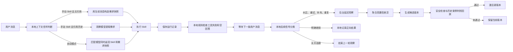
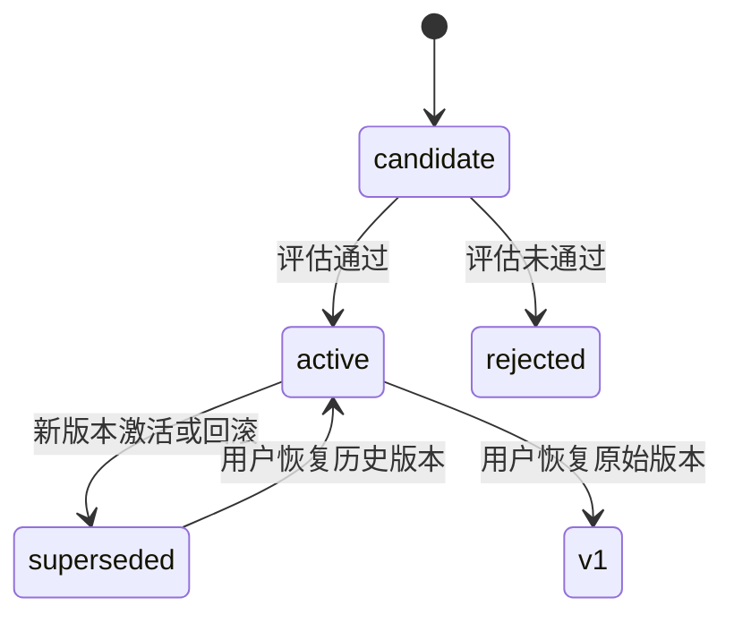

# Skill 持续改进系统设计

## 1. 目标

WahtWay 的 Skill 持续改进系统不依赖点赞、点踩或问卷。系统从用户调用 Skill 前后的自然对话中推断：

- 用户本次真正想完成什么；
- 哪些约束来自当前消息，哪些继承自历史上下文；
- Skill 的回答是否遗漏目标、格式、交付物或长期偏好；
- 问题属于 Skill、匹配器、用户临时要求，还是工具运行时；
- 某个差异是否重复出现，是否值得形成新的 Skill 版本。

系统同时需要满足四个约束：

1. 新对话不能因为没有历史上下文而额外等待观察模型。
2. 正常对话不能每轮固定增加多次模型调用。
3. AI 不能直接覆盖预设 Skill，也不能自行扩大工具权限。
4. 所有改进必须可审计、可评估、可回滚，并且只保存在本地。

## 2. 设计原则

### 2.1 观察与执行分离

执行 Agent 负责完成用户任务，观察器只负责提取需求和判断差异。观察器不能修改当前回答，也不能把用户内容当作可执行指令。

### 2.2 按信号触发

系统不会在每个阶段固定调用模型。能够由本地规则确定的情况直接在本地处理，只有出现上下文引用或疑似负面反馈时才调用观察模型。

### 2.3 证据聚合优先

单次对话只能产生证据，不能直接修改 Skill。只有同类高置信问题在多个独立运行中重复出现，才会进入优化流程。

### 2.4 能力边界不可自动扩大

自动版本只能修改：

- `systemPrompt`
- `description`
- `whenToUse`
- `keywords`

以下字段保持不变：

- `id`
- `name`
- `input`
- `output`
- `requiredTools`
- `allowedTools`

### 2.5 预设版本不可变

仓库中的 Skill JSON 是版本 1。学习版本保存在用户数据目录的覆盖层中，加载时选择当前激活版本，不修改原始 JSON。

## 3. 总体架构



## 4. 新对话与上下文处理

### 4.1 新对话首次手动调用 Skill

历史为空时，系统不调用需求观察模型。当前消息直接形成一个 `NeedSnapshot`：

```json
{
  "primaryGoal": "用户当前消息",
  "constraints": [],
  "expectedDeliverables": [],
  "formatPreferences": [],
  "knownPreferences": [],
  "ambiguities": [],
  "confidence": 0.55
}
```

该快照的来源标记为 `current-message`。后续用户如果纠正或补充要求，延迟观察器会更新对需求差异的判断。

### 4.2 新对话首次自动匹配 Skill

自动模式本来就需要调用一次匹配模型。该调用现在同时返回：

```json
{
  "skillIndex": 0,
  "needSnapshot": {
    "primaryGoal": "...",
    "constraints": [],
    "expectedDeliverables": [],
    "formatPreferences": [],
    "knownPreferences": [],
    "ambiguities": [],
    "confidence": 0.8
  }
}
```

因此不会为了需求提取新增第二个串行请求。快照来源标记为 `skill-match`。

### 4.3 已有历史但没有引用

如果用户开始一个独立的新任务，即使会话中存在历史，也不会调用前置观察模型。系统只使用当前消息，避免把旧任务约束错误带入新任务。

### 4.4 明确引用历史

手动选择 Skill 且消息出现以下信号时，才调用需求观察模型：

- 继续、接着、刚才、之前、上次；
- 还是按之前、照旧、同样的；
- 不是这个意思、改一下、重新来；
- 另外、还要、必须、补充、加上；
- 好的，下一步。

自动匹配模式仍然只调用一次匹配模型，只是会把最近相关历史一并交给该模型。

## 5. 模型调用预算

| 场景 | 匹配调用 | 前置观察 | 回答后观察 | 下一轮观察 |
|---|---:|---:|---:|---:|
| 新对话，手动选择 Skill | 0 | 0 | 0 | 按信号 |
| 新对话，自动匹配 Skill | 1 | 0 | 0 | 按信号 |
| 有历史但无引用，手动 Skill | 0 | 0 | 0 | 按信号 |
| 有历史且引用历史，手动 Skill | 0 | 1 | 0 | 按信号 |
| 有历史且自动匹配 | 1 | 0 | 0 | 按信号 |
| 用户明确接受或切换话题 | 不变 | 不变 | 0 | 0 |
| 用户纠正、重试或补充约束 | 不变 | 不变 | 0 | 1 个后台调用 |

回答完成后的即时阶段只执行本地规则，不调用模型。延迟观察进入串行后台队列，不阻塞当前用户请求。

## 6. 本地信号层

实现文件：`client/be/src/skills/context-signals.ts`

### 6.1 上下文引用判断

`hasUsefulContext()` 同时要求：

1. 会话中已经存在用户或助手消息；
2. 当前消息命中引用、纠正、补充或继续信号。

没有历史时，即使命中“继续”等词，也不会调用上下文观察模型。

### 6.2 后续行为分类

`classifyFollowUp()` 输出三种状态：

- `analyze`：纠正、重试、补充约束或明显重复请求；
- `positive`：明确接受结果或进入下一步；
- `unrelated`：没有证据表明下一句与上一轮有关。

重复请求通过规范化文本和字符 bigram 相似度判断，避免为了相关性判断再调用一个模型。

## 7. 运行记录

每次实际调用非通用 Skill 都创建 `SkillRunRecord`，主要字段如下：

```ts
interface SkillRunRecord {
  id: string;
  traceId: string;
  skillId: string;
  skillVersion: number;
  skillSnapshot: Skill;
  conversationId?: string;
  contextBefore: ConversationTurn[];
  userMessage: string;
  needSnapshot: NeedSnapshot;
  needSnapshotSource: "skill-match" | "context-observer" | "current-message";
  output: string;
  toolCalls: ToolCallSummary[];
  status: "running" | "completed" | "aborted" | "error";
  immediateAssessment?: RunAssessment;
  delayedAssessment?: RunAssessment;
}
```

保存执行时使用的完整 Skill 快照，是为了防止后台分析期间激活了新版本，导致旧回答被错误地按照新 Prompt 评估。

工具调用只保存工具名、成功状态和简短摘要，不保存完整文件内容或工具返回值。

## 8. 差异分类

观察器输出的 `GapEvidence` 区分问题归属：

| 类型 | 含义 | 是否可以自动学习 |
|---|---|---|
| `skill-match` | 选错 Skill 或触发边界错误 | 可以 |
| `skill-prompt` | Skill 指令遗漏稳定能力要求 | 可以 |
| `user-preference` | 当前本地用户的长期偏好 | 重复出现后可以 |
| `session-constraint` | 只属于本次任务的临时条件 | 不可以 |
| `tool-runtime` | 工具、权限或运行环境失败 | 不可以 |
| `ambiguous` | 证据不足，无法归因 | 不可以 |

常见差异类别包括：

- `missing-constraint`
- `wrong-format`
- `incomplete-deliverable`
- `wrong-skill-trigger`
- `excessive-verbosity`
- `insufficient-detail`
- `ignored-context`
- `tool-selection`
- `factual-quality`

## 9. 即时规则评估

回答完成后不调用 LLM，只检查确定性问题：

- 工具调用未完成；
- 最终文本回答为空。

这些问题会进入运行记录，但被强制标记为不可学习，避免工具故障污染 Skill Prompt。正常回答只记录“等待相关后续信号”，不推断满意或不满意。

## 10. 延迟观察

当下一条消息被本地信号层判定为 `analyze` 时，观察模型会收到：

- 上一轮需求快照；
- 上一轮用户请求；
- 上一轮最终回答；
- 即时规则检查结果；
- 当前用户消息。

观察模型输出满足度、差异类型、证据、改进建议、严重度、置信度和是否可学习。

明确接受时，本地记录高满足度且不调用模型。无关话题记录为不确定，不把“用户没有继续抱怨”误判为满意。

## 11. 证据聚合

证据进入优化流程需要同时满足：

- `learnable === true`；
- `confidence >= 0.75`；
- 同一个 `type:category` 在至少 3 个不同 `runId` 中出现；
- 证据没有被之前的候选版本消费。

聚合器优先选择置信度与严重度乘积最高的问题簇。被拒绝的版本也会消费本次证据，只有积累新的重复证据后才会再次尝试，避免对同一批证据循环生成版本。

## 12. 候选版本生成与评估

### 12.1 模型分工

- `SKILL_OBSERVER_MODEL` 默认 `deepseek-v4-flash`，负责按需需求提取和延迟差异分析；
- `SKILL_OPTIMIZER_MODEL` 默认 `deepseek-v4-pro`，只在证据达到阈值后生成和评估候选版本。

### 12.2 候选生成

优化器接收当前 Skill、重复差异证据和最近运行的需求摘要，输出完整的新 `systemPrompt` 以及可选的匹配字段。

服务端重新构造候选 Skill，并强制使用当前版本的 ID、名称、Schema 和工具权限。模型输出无法覆盖这些字段。

### 12.3 判别回放

当前评估属于离线判别回放，不会真正重新执行文件工具。评审模型比较新旧 Prompt 对历史需求和重复差异的覆盖能力。

自动通过必须同时满足：

- 评审模型返回 `approved: true`；
- 没有回归项；
- 候选得分至少为 `0.72`；
- 候选得分比当前版本至少高 `0.05`；
- 输入输出 Schema 和工具权限完全一致。

## 13. 版本状态与回滚



版本 1 不保存在学习版本数组中，它始终来自原始 Skill JSON。历史学习版本只有通过自动评估后才能再次激活，被拒绝的版本不能通过 API 绕过评估直接启用。

## 14. 本地存储

学习数据位于 `WAHTWAY_DATA_DIR/skill-learning/`：

```text
skill-learning/
├── runs/
│   └── {runId}.json
└── skills/
    └── {skillId}.json
```

Skill 状态文件保存：

- 是否开启自动改进；
- 当前激活版本；
- 调用次数；
- 聚合证据；
- 候选、激活、拒绝和历史版本；
- 每个版本的评估结果。

JSON 文件使用临时文件写入后原子替换，降低进程中断造成文件损坏的概率。学习目录已加入 `.gitignore`，不会被提交到仓库。

## 15. API

| 方法 | 路径 | 说明 |
|---|---|---|
| `GET` | `/api/skills` | 返回当前 Skill、版本和学习摘要 |
| `GET` | `/api/skills/:id/learning` | 返回证据和版本历史 |
| `PATCH` | `/api/skills/:id/learning` | 开关自动改进 |
| `POST` | `/api/skills/:id/optimize` | 使用现有高置信证据尝试优化 |
| `POST` | `/api/skills/:id/rollback` | 激活原始版本或已通过评估的历史版本 |

聊天 SSE 的 `skill_matched` 事件增加：

- `skillId`
- `skillVersion`
- `runId`

前端将这些字段写入对应助手消息，保证会话历史可以追溯到具体运行和 Skill 版本。

## 16. 界面

Skill 管理页展示：

- 当前激活版本；
- 已观察运行数；
- 高置信可学习差异数；
- 持续改进开关；
- 最近一次改进建议；
- 证据详情；
- 版本评估分数和状态；
- 恢复原版或历史已验证版本的操作。

## 17. 失败与降级

- 自动匹配失败：降级到通用对话，不创建 Skill 学习记录；
- 手动上下文观察失败：使用当前消息构造基础需求快照，Skill 仍然执行；
- 延迟观察失败：标记本次延迟观察已结束，不阻塞后续对话；
- 候选生成或评估失败：保留当前版本；
- 学习状态文件损坏：回到默认状态和原始版本；
- 进程重启：运行和版本状态从本地 JSON 恢复。

## 18. 隐私与安全

- 学习记录只写入本地用户数据目录；
- 不自动上传 Skill Hub；
- Hub 发布必须由用户主动执行；
- 工具返回只保存摘要；
- 用户对话在观察和优化 Prompt 中被明确标记为数据，不能作为系统指令；
- 自动改进不能增加工具能力；
- 重置应用数据时同时清除学习数据。

## 19. 当前限制

1. 本地信号规则优先保证低成本，可能漏掉没有明显措辞的委婉不满意。
2. 重复请求使用字符 bigram 相似度，不等同于完整语义相似度。
3. 历史评估是判别回放，不是真实重新执行，因此不能验证外部工具副作用。
4. 当前后台观察队列是单进程串行队列，适合本地单用户应用，不适合直接扩展为多租户服务。
5. 当前运行记录尚未配置按时间或数量自动清理策略，后续应增加保留期限设置。

## 20. 后续演进

- 为运行记录增加数量和时间双重保留策略；
- 用本地轻量 embedding 改进重复请求检测，同时保持零远程调用；
- 为有确定输出 Schema 的 Skill 增加本地结构校验；
- 对无工具 Skill 增加可选的真实离线 A/B 回放；
- 将通用 Skill 改进与用户个性偏好拆成两个独立 Prompt 层；
- 增加观察调用次数、跳过原因、队列长度和模型成本统计；
- 发布到 Hub 前生成隐私检查报告和版本 changelog。

## 21. 代码位置

| 模块 | 路径 |
|---|---|
| 本地上下文信号 | `client/be/src/skills/context-signals.ts` |
| Skill 匹配与需求合并 | `client/be/src/skills/matcher.ts` |
| 观察、聚合、优化与评估 | `client/be/src/skills/learning-engine.ts` |
| 本地运行和版本存储 | `client/be/src/skills/learning-store.ts` |
| Agent 调用链接入 | `client/be/src/agent.ts` |
| Skill 学习 API | `client/be/src/routes/skills.ts` |
| 前端消息归因和管理界面 | `client/src/conversations.ts`、`client/src/App.tsx` |

